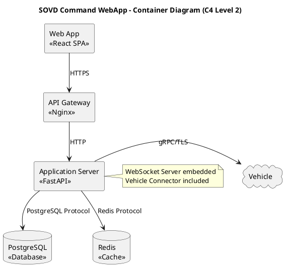

# Code Refinement Task

The previous code submission did not pass verification. The PlantUML diagram files required by task I1.T2 have not been created.

---

## Original Task Description

Create PlantUML source files for Component Diagram (C4 Level 3 - Application Server internal components) and Container Diagram (C4 Level 2 - deployable containers). Component diagram must include: API Router, Auth Controller, Vehicle Controller, Command Controller, Auth Service, Vehicle Service, Command Service, Audit Service, SOVD Protocol Handler, Repository Layer (Vehicle/Command/Response/User repositories), Shared Kernel. Container diagram must include: Web App (React SPA), API Gateway (Nginx), Application Server (FastAPI), WebSocket Server (FastAPI embedded), Vehicle Connector, PostgreSQL, Redis. Include all relationships and communication protocols.

**Target Files:**
- `docs/diagrams/component_diagram.puml`
- `docs/diagrams/container_diagram.puml`

**Acceptance Criteria:**
- PlantUML files compile without errors (test with `plantuml -testdot` or online renderer)
- Component diagram shows all modules listed in description with correct dependencies
- Container diagram shows all containers with communication protocols labeled
- Diagrams match Architecture Blueprint diagrams in Sections 3.4 and 3.5
- Files committed to `docs/diagrams/` directory

---

## Issues Detected

* **Missing Files:** Neither `docs/diagrams/component_diagram.puml` nor `docs/diagrams/container_diagram.puml` exist in the repository.
* **Task Not Started:** The task appears to have not been started. The `docs/diagrams/` directory exists but is empty except for a `rendered/` subdirectory.

---

## Best Approach to Fix

You MUST create two PlantUML files in the `docs/diagrams/` directory. Follow these specific instructions:

### 1. Create Container Diagram (`docs/diagrams/container_diagram.puml`)

This diagram must show the C4 Level 2 architecture with all deployable containers:

**Required Containers:**
- Web App (React SPA) - served by Nginx on port 3000 (dev), 80/443 (prod)
- API Gateway (Nginx) - reverse proxy, TLS termination, routes /api/* to Application Server
- Application Server (FastAPI) - main backend application on port 8000
- WebSocket Server (embedded in Application Server, not separate) - handles /ws/responses/{command_id}
- Vehicle Connector (initially part of Application Server) - gRPC client for vehicle communication
- PostgreSQL Database - port 5432, primary data store
- Redis Cache - port 6379, session storage, caching, Pub/Sub

**Required Communication Flows (with protocols):**
- User → Web App: HTTPS
- Web App → API Gateway: HTTPS, REST API calls, WebSocket upgrade
- API Gateway → Application Server: HTTP (reverse proxy)
- Application Server → PostgreSQL: PostgreSQL protocol (asyncpg)
- Application Server → Redis: Redis protocol, Pub/Sub
- Application Server (Vehicle Connector) → Vehicle: gRPC over TLS
- Application Server → WebSocket Clients: WebSocket (ws:// or wss://)
- Redis Pub/Sub → Application Server: Internal event bus

**PlantUML Structure:**
- Use `@startuml` and `@enduml` tags
- Add a title: `title SOVD Command WebApp - Container Diagram (C4 Level 2)`
- Use appropriate PlantUML elements: `component`, `database`, `cloud`, `rectangle`
- Add technology stereotypes (e.g., `<<React>>`, `<<FastAPI>>`, `<<PostgreSQL>>`)
- Label all arrows with protocols
- Use `-->` for synchronous communication, `..>` for asynchronous
- Add notes where needed for clarifications (e.g., "WebSocket server embedded in FastAPI")

### 2. Create Component Diagram (`docs/diagrams/component_diagram.puml`)

This diagram must show the internal structure of the Application Server (FastAPI) only - C4 Level 3:

**Required Components by Layer:**

**API Router Layer:**
- Auth Controller (`app/api/v1/auth.py`) - POST /login, POST /refresh, POST /logout, GET /me
- Vehicle Controller (`app/api/v1/vehicles.py`) - GET /vehicles, GET /vehicles/{id}, GET /vehicles/{id}/status
- Command Controller (`app/api/v1/commands.py`) - POST /commands, GET /commands/{id}, GET /commands, GET /commands/{id}/responses
- WebSocket Handler (`app/api/v1/websocket.py`) - /ws/responses/{command_id}

**Service Layer:**
- Auth Service (`app/services/auth_service.py`) - JWT generation/validation, password hashing, user authentication
- Vehicle Service (`app/services/vehicle_service.py`) - Vehicle management, status queries, caching
- Command Service (`app/services/command_service.py`) - Command submission, validation, orchestration, status tracking
- Audit Service (`app/services/audit_service.py`) - Audit logging for critical operations
- WebSocket Manager (`app/services/websocket_manager.py`) - WebSocket connection lifecycle, broadcasting, Redis Pub/Sub listener

**Integration/Connector Layer:**
- SOVD Protocol Handler (`app/services/sovd_protocol_handler.py`) - SOVD 2.0 command validation, encoding/decoding, schema validation
- Vehicle Connector (`app/connectors/vehicle_connector.py`) - gRPC client, command execution, response streaming, retry logic

**Repository Layer:**
- User Repository (`app/repositories/user_repository.py`)
- Vehicle Repository (`app/repositories/vehicle_repository.py`)
- Command Repository (`app/repositories/command_repository.py`)
- Response Repository (`app/repositories/response_repository.py`)
- Session Repository (`app/repositories/session_repository.py`)
- Audit Log Repository (`app/repositories/audit_log_repository.py`)

**Shared Kernel:**
- Database Module (`app/database.py`) - async engine, session factory
- Config Module (`app/config.py`) - Pydantic Settings
- Dependencies Module (`app/dependencies.py`) - get_current_user, require_role (RBAC)
- Middleware (`app/middleware/`) - logging_middleware.py, error_handling_middleware.py
- Utils (`app/utils/`) - logging.py, error_codes.py

**Required Dependencies (arrows):**
- Auth Controller → Auth Service
- Vehicle Controller → Vehicle Service
- Command Controller → Command Service
- WebSocket Handler → WebSocket Manager, Redis Pub/Sub
- Auth Service → User Repository, Session Repository, Redis
- Vehicle Service → Vehicle Repository, Redis
- Command Service → Command Repository, Response Repository, SOVD Protocol Handler, Vehicle Connector, Audit Service
- Audit Service → Audit Log Repository
- WebSocket Manager → Redis Pub/Sub
- SOVD Protocol Handler → (no database dependencies, pure logic)
- Vehicle Connector → Response Repository
- All Repositories → Database Module (from Shared Kernel)
- All Services → Config Module, Dependencies Module

**PlantUML Structure:**
- Use `@startuml` and `@enduml` tags
- Add a title: `title SOVD Command WebApp - Component Diagram (C4 Level 3 - Application Server)`
- Organize components into packages/layers: `package "API Router Layer"`, `package "Service Layer"`, etc.
- Use `component` for each module
- Show dependencies with arrows (`-->`)
- Add file path annotations (e.g., `[Auth Controller\n(app/api/v1/auth.py)]`)
- Use different colors or styles to distinguish layers

### 3. Validation Steps

After creating both files:
1. Verify PlantUML syntax is valid (test at http://www.plantuml.com/plantuml/)
2. Ensure all components from the requirements are present
3. Verify all communication protocols are labeled
4. Check that dependency arrows are correct (no circular dependencies within layers, proper layering)
5. Confirm file paths are correct: `docs/diagrams/component_diagram.puml` and `docs/diagrams/container_diagram.puml`

### 4. Critical Reminders

- The WebSocket Server is NOT a separate container - it's embedded in the FastAPI Application Server
- The Vehicle Connector is initially part of the Application Server (can be shown as a component within or with a note indicating future separation potential)
- Include ALL 6 repositories in the component diagram
- Show the Shared Kernel as a separate package that other components depend on
- Match terminology exactly as specified in the architecture documentation

### 5. Example PlantUML Snippet (Container Diagram starter)

This is just a starter - you must expand it to include all containers, all communication flows, and all protocols as specified above. Create a similar comprehensive structure for the component diagram.
