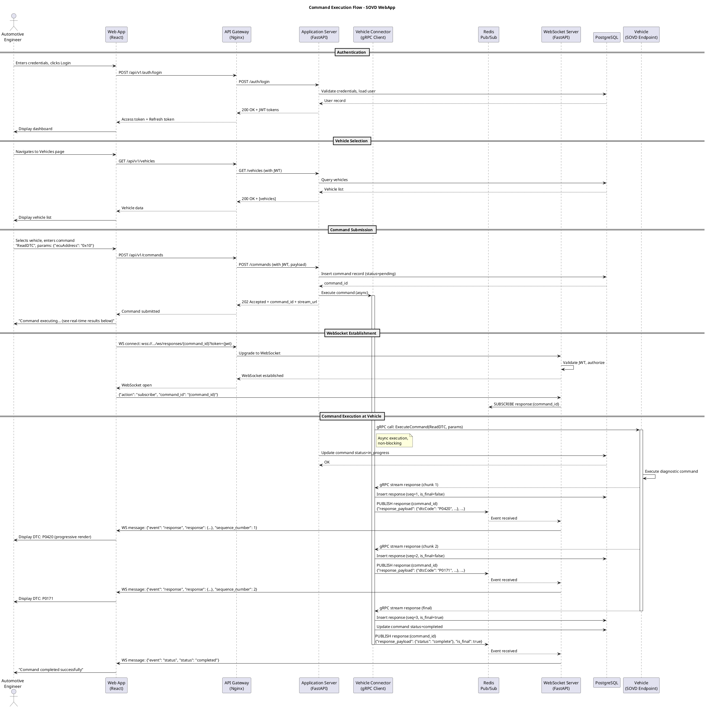
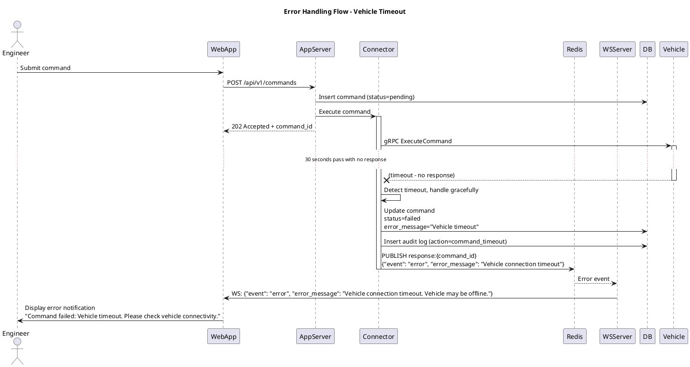

# Task Briefing Package

This package contains all necessary information and strategic guidance for the Coder Agent.

---

## 1. Current Task Details

This is the full specification of the task you must complete.

```json
{
  "task_id": "I2.T8",
  "iteration_id": "I2",
  "iteration_goal": "Core Backend APIs - Authentication, Vehicles, Commands",
  "description": "Create PlantUML sequence diagram `docs/diagrams/sequence_command_flow.puml` illustrating end-to-end command execution flow from user login to command completion and response delivery. Diagram must include actors/systems: Engineer (user), Web App, API Gateway, Application Server (with sub-components: Auth Service, Command Service, Vehicle Connector), Redis Pub/Sub, WebSocket Server (note: WebSocket not implemented yet, show placeholder), Database, Vehicle. Flow: 1) User login (auth flow), 2) User selects vehicle (GET /vehicles), 3) User submits command (POST /commands), 4) Backend validates command (SOVD handler), 5) Command record created (database), 6) Async execution triggered (Vehicle Connector), 7) Mock vehicle response generated, 8) Response published to Redis, 9) Response saved to database, 10) Command status updated to completed. Reference Architecture Blueprint Section 3.7 (Key Interaction Flow). Create companion diagram `docs/diagrams/sequence_error_flow.puml` showing error scenario (vehicle timeout or validation failure).",
  "agent_type_hint": "DiagrammingAgent",
  "inputs": "Architecture Blueprint Section 3.7 (Sequence Diagrams); implemented APIs from I2.T1-I2.T7.",
  "target_files": [
    "docs/diagrams/sequence_command_flow.puml",
    "docs/diagrams/sequence_error_flow.puml"
  ],
  "input_files": [],
  "deliverables": "Two PlantUML sequence diagrams documenting command execution (success and error flows).",
  "acceptance_criteria": "PlantUML files compile without errors; `sequence_command_flow.puml` matches Architecture Blueprint Section 3.7 (Command Execution Flow); All actors/systems from description included; Flow shows all 10 steps listed in description; `sequence_error_flow.puml` shows validation error scenario (400 Bad Request returned); Diagrams include notes explaining key decision points; Files committed to `docs/diagrams/`",
  "dependencies": [
    "I2.T1",
    "I2.T2",
    "I2.T3",
    "I2.T4",
    "I2.T5",
    "I2.T6",
    "I2.T7"
  ],
  "parallelizable": true,
  "done": false
}
```

---

## 2. Architectural & Planning Context

The following are the relevant sections from the architecture and plan documents, which I found by analyzing the task description.

### Context: key-interaction-flow (from 04_Behavior_and_Communication.md)

```markdown
#### Key Interaction Flow (Sequence Diagram)

##### Description: Command Execution Flow

This sequence diagram illustrates the critical workflow of a user executing an SOVD command and receiving a streaming response. It demonstrates:

1. **Authentication**: User logs in and receives JWT
2. **Vehicle Selection**: User queries available vehicles
3. **Command Submission**: User submits SOVD command via REST API
4. **WebSocket Establishment**: UI establishes WebSocket for real-time updates
5. **Command Execution**: Backend forwards command to vehicle via gRPC
6. **Streaming Response**: Vehicle sends multiple response chunks
7. **Event Publishing**: Vehicle Connector publishes to Redis
8. **Real-Time Delivery**: WebSocket Server pushes to UI
9. **Completion**: Final response marks command complete

This flow showcases the hybrid REST + WebSocket architecture for optimal user experience.
```

### Context: sequence-diagram-plantuml (from 04_Behavior_and_Communication.md)



### Context: error-handling-flow (from 04_Behavior_and_Communication.md)

```markdown
#### Error Handling Flow (Sequence Diagram)

##### Description: Vehicle Timeout Scenario

This diagram illustrates graceful error handling when a vehicle fails to respond within the timeout period (e.g., 30 seconds):

1. Command is submitted and forwarded to vehicle
2. Vehicle does not respond (connection lost, vehicle offline, etc.)
3. Vehicle Connector detects timeout
4. Error is logged to database and audit log
5. Error event is published to WebSocket
6. User receives clear error message with suggested actions
```

### Context: error-diagram-plantuml (from 04_Behavior_and_Communication.md)



### Context: auth-endpoints (from 04_Behavior_and_Communication.md)

```markdown
**Authentication Endpoints**

```
POST   /api/v1/auth/login
Request:  { "username": "string", "password": "string" }
Response: { "access_token": "string", "refresh_token": "string", "expires_in": 900 }

POST   /api/v1/auth/refresh
Request:  { "refresh_token": "string" }
Response: { "access_token": "string", "expires_in": 900 }

POST   /api/v1/auth/logout
Headers:  Authorization: Bearer {token}
Response: { "message": "Logged out successfully" }

GET    /api/v1/auth/me
Headers:  Authorization: Bearer {token}
Response: { "user_id": "uuid", "username": "string", "role": "string" }
```
```

### Context: vehicle-endpoints (from 04_Behavior_and_Communication.md)

```markdown
**Vehicle Endpoints**

```
GET    /api/v1/vehicles
Headers:  Authorization: Bearer {token}
Query:    ?status=connected&search=VIN123
Response: [
  {
    "vehicle_id": "uuid",
    "vin": "string",
    "make": "string",
    "model": "string",
    "year": 2024,
    "connection_status": "connected",
    "last_seen_at": "2025-10-28T10:00:00Z"
  }
]

GET    /api/v1/vehicles/{vehicle_id}
Headers:  Authorization: Bearer {token}
Response: { "vehicle_id": "uuid", "vin": "string", ... }

GET    /api/v1/vehicles/{vehicle_id}/status
Headers:  Authorization: Bearer {token}
Response: {
  "connection_status": "connected",
  "last_seen_at": "2025-10-28T10:00:00Z",
  "health": { "signal_strength": 4, "battery": 12.6 }
}
```
```

### Context: command-endpoints (from 04_Behavior_and_Communication.md)

```markdown
**Command Endpoints**

```
POST   /api/v1/commands
Headers:  Authorization: Bearer {token}
Request:  {
  "vehicle_id": "uuid",
  "command_name": "ReadDTC",
  "command_params": { "ecuAddress": "0x10", "format": "UDS" }
}
Response: {
  "command_id": "uuid",
  "status": "pending",
  "submitted_at": "2025-10-28T10:00:00Z",
  "stream_url": "wss://api.sovd.example.com/ws/responses/{command_id}"
}

GET    /api/v1/commands/{command_id}
Headers:  Authorization: Bearer {token}
Response: {
  "command_id": "uuid",
  "vehicle_id": "uuid",
  "command_name": "ReadDTC",
  "command_params": { ... },
  "status": "completed",
  "submitted_at": "2025-10-28T10:00:00Z",
  "completed_at": "2025-10-28T10:00:01.5Z"
}

GET    /api/v1/commands/{command_id}/responses
Headers:  Authorization: Bearer {token}
Response: [
  {
    "response_id": "uuid",
    "response_payload": { "dtcCode": "P0420", "description": "Catalyst System Efficiency Below Threshold" },
    "sequence_number": 1,
    "is_final": false,
    "received_at": "2025-10-28T10:00:01Z"
  },
  {
    "response_id": "uuid",
    "response_payload": { "status": "complete" },
    "sequence_number": 2,
    "is_final": true,
    "received_at": "2025-10-28T10:00:01.5Z"
  }
]

GET    /api/v1/commands
Headers:  Authorization: Bearer {token}
Query:    ?vehicle_id=uuid&status=completed&limit=20&offset=0
Response: [
  { "command_id": "uuid", "command_name": "ReadDTC", "status": "completed", ... }
]
```
```

### Context: websocket-protocol (from 04_Behavior_and_Communication.md)

```markdown
**WebSocket Protocol**

```
Connection: wss://api.sovd.example.com/ws/responses/{command_id}?token={jwt}

Client → Server (subscribe):
{
  "action": "subscribe",
  "command_id": "uuid"
}

Server → Client (response event):
{
  "event": "response",
  "command_id": "uuid",
  "response": {
    "response_id": "uuid",
    "response_payload": { "dtcCode": "P0420", ... },
    "sequence_number": 1,
    "is_final": false,
    "received_at": "2025-10-28T10:00:01Z"
  }
}

Server → Client (status event):
{
  "event": "status",
  "command_id": "uuid",
  "status": "completed",
  "completed_at": "2025-10-28T10:00:01.5Z"
}

Server → Client (error event):
{
  "event": "error",
  "command_id": "uuid",
  "error_message": "Vehicle connection timeout"
}
```
```

---

## 3. Codebase Analysis & Strategic Guidance

The following analysis is based on my direct review of the current codebase. Use these notes and tips to guide your implementation.

### Relevant Existing Code

*   **File:** `docs/diagrams/component_diagram.puml`
    *   **Summary:** This file demonstrates the existing PlantUML style used in the project. It uses the C4 PlantUML library with `!include https://raw.githubusercontent.com/plantuml-stdlib/C4-PlantUML/master/C4_Component.puml` for consistent component modeling.
    *   **Recommendation:** Your sequence diagrams SHOULD follow a similar professional style. Use standard PlantUML syntax (NOT C4 for sequence diagrams - C4 is for architecture diagrams). Ensure proper formatting with `@startuml` and `@enduml` tags, clear titles, and consistent participant naming.

*   **File:** `backend/app/services/command_service.py`
    *   **Summary:** This file contains the core command submission logic. Key function: `submit_command()` which validates the vehicle, validates SOVD command via `sovd_protocol_handler`, creates command record, and triggers async execution via `vehicle_connector.execute_command()` using FastAPI BackgroundTasks.
    *   **Recommendation:** Your sequence diagram MUST accurately reflect this implementation. The diagram should show: (1) Command validation check, (2) Database insertion with status='pending', (3) Async trigger to vehicle connector (not blocking), (4) Return 202 Accepted immediately to client.

*   **File:** `backend/app/connectors/vehicle_connector.py`
    *   **Summary:** This is the mock vehicle connector that simulates command execution. Key workflow: (1) Simulates network delay with `asyncio.sleep()`, (2) Updates command status to 'in_progress', (3) Generates mock response using MOCK_RESPONSE_GENERATORS, (4) Saves response to database via `response_repository.create_response()`, (5) Publishes event to Redis Pub/Sub channel `response:{command_id}`, (6) Updates command status to 'completed', (7) Logs audit event via `audit_service.log_audit_event()`.
    *   **Recommendation:** Your sequence diagram MUST show this exact flow. Note that this is currently a MOCK implementation - the diagram should show "Mock Vehicle Response Generation" as a placeholder, with a note indicating this will be replaced with real gRPC calls in future iterations. The Redis publishing is critical - ensure this is clearly shown as the mechanism for real-time updates.

*   **File:** `backend/app/api/v1/auth.py`
    *   **Summary:** This file implements the authentication endpoints. Key flow in `login()`: (1) Extracts client IP/user-agent, (2) Calls `authenticate_user()` to validate credentials, (3) Generates access and refresh tokens, (4) Stores refresh token in database (Session table), (5) Logs audit event, (6) Returns TokenResponse.
    *   **Recommendation:** Your sequence diagram should accurately represent the authentication flow showing all these steps, including the database interaction to store the session and the audit logging.

### Implementation Tips & Notes

*   **Tip:** I noticed the architecture blueprint (Section 3.7) shows WebSocket Server as a separate component, but in the current implementation (as per task description), WebSocket is NOT yet implemented. Your diagram MUST include a note or placeholder indicating "WebSocket Server (not yet implemented - shown for completeness)". This maintains alignment with the architecture while being honest about current state.

*   **Note:** The existing `component_diagram.puml` uses the C4 PlantUML library, which is excellent for component/container diagrams but NOT appropriate for sequence diagrams. For your task, use standard PlantUML sequence diagram syntax without the C4 include. Reference: https://plantuml.com/sequence-diagram

*   **Note:** The mock vehicle connector currently generates a single response with `sequence_number=1` and `is_final=True`. However, the architecture blueprint shows multi-chunk streaming responses. Your sequence diagram should follow the blueprint (showing multiple chunks) as this represents the intended final state, even though the current mock only sends one chunk. Add a note explaining this discrepancy.

*   **Critical:** For the error flow diagram (`sequence_error_flow.puml`), the task description mentions "validation failure" but the architecture blueprint focuses on "vehicle timeout". You MUST create TWO scenarios in the error diagram or create separate diagrams: (1) Validation error (400 Bad Request returned immediately before vehicle connector is called), (2) Vehicle timeout (after 30 seconds, as shown in blueprint). The validation error scenario is simpler and happens synchronously in `command_service.submit_command()` when `sovd_protocol_handler.validate_command()` returns an error.

*   **Warning:** Ensure all participant names in your diagrams match the architecture terminology exactly. Use "Application Server (FastAPI)" not just "Backend", "Vehicle Connector (gRPC Client)" not just "Connector", etc. This ensures consistency with the existing component diagram and architecture blueprint.

*   **Best Practice:** The architecture blueprint sequence diagram is extremely detailed (60+ lines). While you should include all the key steps from the 10-point list in the task description, you may need to consolidate some steps to keep the diagram readable. For example, you can combine "Response saved to database" and "Response published to Redis" into a single section with two sequential operations, rather than showing every database transaction separately.

*   **PlantUML Syntax Reminder:**
    - Use `actor` for human users (Engineer)
    - Use `participant` for system components
    - Use `->` for synchronous calls (request-response)
    - Use `-->` for return messages
    - Use `activate`/`deactivate` to show component lifecycle
    - Use `note right of` or `note left of` to add explanatory comments
    - Use `==Section Name==` to group related interactions
    - Use `...` to indicate time passing (useful for timeout scenario)

*   **Validation Checklist Before Committing:**
    1. Run PlantUML compiler (if available) or use an online validator (plantuml.com/plantuml)
    2. Verify all 10 steps from task description are present in sequence_command_flow.puml
    3. Verify error scenarios (validation + timeout) are shown in sequence_error_flow.puml
    4. Check that all actors/systems from task description are included
    5. Ensure notes explain key decision points (async execution, mock vs. real vehicle, Redis as pub/sub mechanism)
    6. Confirm diagram titles are clear and descriptive
    7. Verify consistency with existing diagrams in docs/diagrams/ directory

---

**End of Task Briefing Package**

This briefing is your complete guide to implementing Task I2.T8. Follow the architecture blueprint examples closely, accurately represent the implemented backend code, and create professional, readable sequence diagrams that will serve as valuable documentation for the development team.
