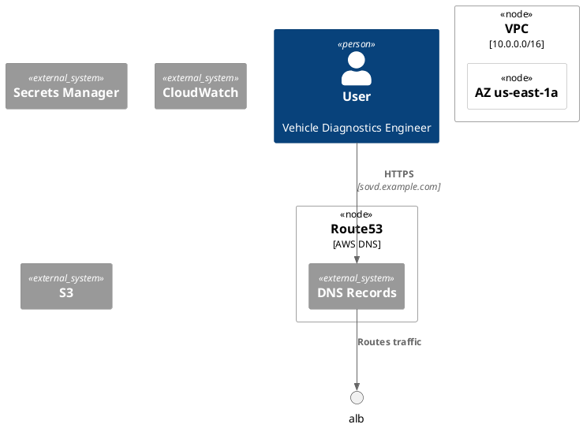
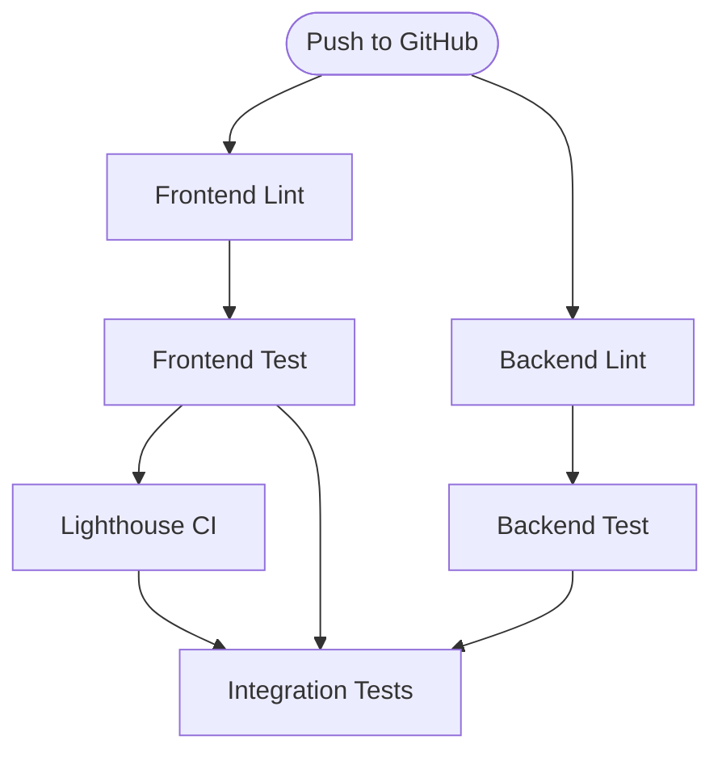
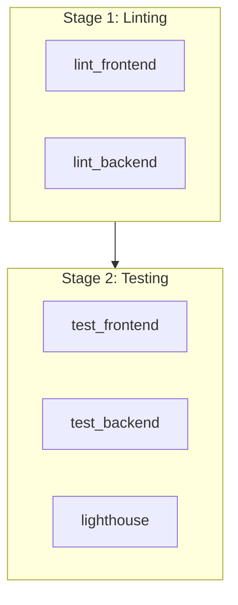

# Task Briefing Package

This package contains all necessary information and strategic guidance for the Coder Agent.

---

## 1. Current Task Details

This is the full specification of the task you must complete.

```json
{
  "task_id": "I5.T4",
  "iteration_id": "I5",
  "iteration_goal": "Production Deployment Infrastructure - Kubernetes, CI/CD & gRPC Foundation",
  "description": "Create deployment diagram (PlantUML) showing AWS EKS: VPC (public/private subnets, 3 AZs), ALB, EKS (3 nodes, pods), RDS Multi-AZ, ElastiCache, NAT, Route53, Secrets Manager, CloudWatch, S3. Show connections with protocols. Create CI/CD pipeline diagram (Mermaid) showing GitHub Actions workflow stages.",
  "agent_type_hint": "DiagrammingAgent",
  "inputs": "Architecture Blueprint Section 3.9; Helm chart, CI/CD from I5.T2/T3.",
  "target_files": [
    "docs/diagrams/deployment_diagram.puml",
    "docs/diagrams/ci_cd_pipeline.md"
  ],
  "input_files": [],
  "deliverables": "PlantUML deployment diagram; Mermaid CI/CD diagram.",
  "acceptance_criteria": "deployment_diagram.puml compiles; Shows all components from Blueprint 3.9; VPC structure clear; EKS across 3 AZs; Connections labeled; ci_cd_pipeline.md renders as Mermaid; Matches actual pipeline stages; Both committed",
  "dependencies": [
    "I5.T2",
    "I5.T3"
  ],
  "parallelizable": true,
  "done": false
}
```

---

## 2. Architectural & Planning Context

The following are the relevant sections that provide guidance for creating these diagrams. While the full architecture blueprint files were not found in the repository (they may be in external documentation), the existing implementation files provide all the necessary information.

### Context: Production Deployment Infrastructure (from Helm Chart)

**Source**: `infrastructure/helm/sovd-webapp/values.yaml` (I5.T2 deliverable)

The Helm chart reveals the complete Kubernetes deployment structure:

**Backend Service Configuration**:
- 3 replicas with pod anti-affinity for high availability
- Resources: 256Mi/250m CPU (requests), 512Mi/500m CPU (limits)
- Health checks: `/health/live` (liveness), `/health/ready` (readiness with DB/Redis checks)
- Pod runs as non-root user (1001) with dropped capabilities

**Frontend Service Configuration**:
- 3 replicas with pod anti-affinity
- Resources: 64Mi/100m CPU (requests), 128Mi/200m CPU (limits)
- Nginx-based static file serving

**Horizontal Pod Autoscaler (HPA)**:
- Backend: 3-10 replicas, target CPU 70%, scale up/down policies
- Frontend: 2-5 replicas, target CPU 70%

**Ingress (AWS ALB)**:
- Internet-facing Application Load Balancer
- HTTP (80) and HTTPS (443) listeners
- Path-based routing: `/api` and `/ws` → backend, `/` → frontend
- Target type: IP (for direct pod access)

**External Services**:
- PostgreSQL: RDS Multi-AZ deployment (from config section)
- Redis: ElastiCache (from config section)
- Secrets: AWS Secrets Manager (via External Secrets Operator)

### Context: CI/CD Pipeline (from GitHub Actions Workflow)

**Source**: `.github/workflows/ci-cd.yml` (I5.T3 deliverable)

The CI/CD pipeline consists of the following stages:

**Stage 1: Parallel Linting**
- `frontend-lint`: ESLint + Prettier (Node.js 18)
- `backend-lint`: Ruff + Black + mypy (Python 3.11)

**Stage 2: Parallel Testing**
- `frontend-test`: Vitest with 80% coverage requirement
- `backend-test`: pytest with PostgreSQL/Redis services, 80% coverage requirement
- `frontend-lighthouse`: Lighthouse CI performance testing (score >90)

**Stage 3: Integration Tests**
- `integration-tests`: docker-compose orchestration, backend integration test suite
- Depends on: frontend-test, backend-test

**Stage 4: E2E Tests**
- `e2e-tests`: Playwright tests with full stack (chromium + firefox)
- Depends on: integration-tests

**Stage 5: Security Scans (Parallel)**
- `backend-security`: Bandit + pip-audit
- `frontend-security`: npm audit + ESLint security rules

**Stage 6: Docker Image Builds (Parallel)**
- `build-backend-image`: Multi-stage Dockerfile.prod, push to GitHub Container Registry
- `build-frontend-image`: Multi-stage Dockerfile.prod with Nginx
- Both tag with SHA + latest
- Depends on: tests, security scans, integration tests, E2E tests

**Stage 7: Container Security Scans**
- `trivy-scan-backend`: Scan backend image for CRITICAL/HIGH vulnerabilities
- `trivy-scan-frontend`: Scan frontend image
- Uploads SARIF to GitHub Security tab

**Stage 8: Staging Deployment**
- `deploy-staging`: Auto-deploy on `develop` branch push
- Helm upgrade with image SHA tags
- Smoke tests verification
- Depends on: image builds, Trivy scans

**Stage 9: Production Deployment**
- `deploy-production`: Manual approval required (GitHub environment: production)
- Only on `main` branch
- Rolling update strategy (maxSurge=1, maxUnavailable=0)
- Smoke tests + automatic rollback on failure

**Stage 10: CI Summary**
- `ci-success`: Aggregates all job results, fails if any job failed

---

## 3. Codebase Analysis & Strategic Guidance

The following analysis is based on my direct review of the current codebase. Use these notes and tips to guide your implementation.

### Relevant Existing Code

**File: `infrastructure/helm/sovd-webapp/Chart.yaml`**
- **Summary**: Helm chart metadata defining the SOVD Command WebApp application version 1.0.0
- **Recommendation**: This confirms the deployment target is Helm-based Kubernetes. Your deployment diagram MUST reflect this Helm-orchestrated architecture.

**File: `infrastructure/helm/sovd-webapp/values.yaml`**
- **Summary**: Complete Kubernetes resource definitions including backend (3 replicas), frontend (3 replicas), HPA configuration, AWS ALB ingress, and External Secrets integration
- **Recommendation**: You MUST extract the following infrastructure components for the deployment diagram:
  - **VPC Structure**: Public subnets (ALB), private subnets (EKS pods, RDS, ElastiCache)
  - **EKS Cluster**: 3 availability zones with worker nodes
  - **Pods**: Backend (3-10 replicas), Frontend (2-5 replicas)
  - **Load Balancer**: AWS ALB with path-based routing
  - **Database**: RDS Multi-AZ PostgreSQL (referenced as `postgres.default.svc.cluster.local` or external RDS endpoint)
  - **Cache**: ElastiCache Redis (referenced as `redis.default.svc.cluster.local` or external endpoint)
  - **Secrets**: AWS Secrets Manager with External Secrets Operator
  - **Observability**: CloudWatch (implied for EKS/RDS/ALB monitoring)

**File: `.github/workflows/ci-cd.yml`**
- **Summary**: Comprehensive GitHub Actions workflow with 10 distinct stages (linting → testing → security → build → deploy)
- **Recommendation**: Your CI/CD pipeline diagram MUST show the following stages in sequence/parallel:
  1. **Parallel Linting**: frontend-lint + backend-lint
  2. **Parallel Testing**: frontend-test + backend-test + frontend-lighthouse
  3. **Integration Tests**: integration-tests (depends on tests)
  4. **E2E Tests**: e2e-tests (depends on integration-tests)
  5. **Parallel Security**: backend-security + frontend-security
  6. **Parallel Builds**: build-backend-image + build-frontend-image (depends on all tests/security)
  7. **Parallel Trivy Scans**: trivy-scan-backend + trivy-scan-frontend
  8. **Conditional Staging Deploy**: deploy-staging (only on develop branch)
  9. **Conditional Production Deploy**: deploy-production (only on main, manual approval)
  10. **CI Summary**: ci-success (aggregates all results)

**File: `docker-compose.yml`**
- **Summary**: Local development orchestration with db, redis, backend, frontend, prometheus, and grafana services
- **Recommendation**: This is the LOCAL development setup. Your deployment diagram should show the PRODUCTION AWS infrastructure, not docker-compose. However, the service relationships (backend → db, backend → redis, frontend → backend) are the same in both environments.

### Implementation Tips & Notes

#### For Deployment Diagram (PlantUML)

**Tip: AWS EKS Multi-AZ Architecture**
- Use PlantUML's `deployment` diagram or `C4-Deployment` diagram style
- Show 3 availability zones (us-east-1a, us-east-1b, us-east-1c is a common pattern)
- Place ALB in public subnets across all AZs
- Place EKS worker nodes in private subnets across all AZs
- Place RDS Multi-AZ (primary + standby) in private subnets
- Place ElastiCache in private subnets

**Tip: Network Flow and Protocols**
- External users → Route53 (DNS) → ALB (HTTPS 443)
- ALB → Backend Pods (HTTP 8000 on `/api`, `/ws`)
- ALB → Frontend Pods (HTTP 80 on `/`)
- Backend Pods → RDS (PostgreSQL 5432)
- Backend Pods → ElastiCache (Redis 6379)
- Backend Pods → AWS Secrets Manager (HTTPS 443 via External Secrets Operator)
- All services → CloudWatch (metrics/logs)

**Tip: PlantUML Component Organization**


**Warning: PlantUML Syntax Strictness**
- Ensure all opening braces `{` have closing braces `}`
- Use proper PlantUML keywords: `Deployment_Node`, `Container`, `System_Ext`, `Rel`
- Test compilation with `plantuml -testdot` or online PlantUML editor before committing

**Note: Existing Diagram Files**
- I found existing PlantUML diagrams in `docs/diagrams/`: `component_diagram.puml`, `container_diagram.puml`, `erd.puml`, `sequence_command_flow.puml`, `sequence_error_flow.puml`
- You SHOULD review these files to maintain consistent PlantUML style and formatting
- The deployment diagram should be at a HIGHER abstraction level (C4 Level 3/4: infrastructure and deployment nodes)

#### For CI/CD Pipeline Diagram (Mermaid)

**Tip: Mermaid Flowchart Syntax**
- Use `graph TD` (top-down) or `graph LR` (left-right) for pipeline flow
- Show parallel jobs using subgraphs
- Use different node shapes for different stages:
  - `[Linting]` for rectangular boxes
  - `{Security Scan}` for diamond (decision/gate)
  - `((Build))` for circular nodes
  - `[/Deploy/]` for trapezoid (deploy actions)

**Tip: Showing Parallelism and Dependencies**


**Note: GitHub Actions Dependency Graph**
- Your diagram MUST accurately reflect the `needs:` dependencies in the workflow file
- For example: `deploy-staging` needs `[build-backend-image, build-frontend-image, trivy-scan-backend, trivy-scan-frontend]`
- Show conditional logic: "deploy-staging runs only on `develop` branch"

**Tip: Representing Manual Approval**
- Use a special node style for the production deployment manual approval gate
- Example: `production_approval{Manual Approval Required}`
- Reference the GitHub environment: `production` in the annotation

**Warning: Mermaid Rendering Compatibility**
- The file is named `ci_cd_pipeline.md` (Markdown format)
- You MUST wrap the Mermaid code in triple backticks with `mermaid` language identifier:
  ````markdown
  ```mermaid
  graph TD
      ...
  ```
  ````
- Add descriptive markdown text before/after the diagram explaining the pipeline stages

**Recommendation: Use Subgraphs for Stage Grouping**


### Cross-Cutting Concerns

**Version Control Best Practices**
- Commit both diagrams in a single commit with a descriptive message
- Example commit message: `feat(docs): add AWS deployment and CI/CD pipeline diagrams (I5.T4)`
- Follow the existing commit message style in the repository (I observed commits like `feat(ci-cd): implement complete CI/CD pipeline...`)

**Documentation Standards**
- Add a comment header to the PlantUML file explaining what the diagram represents
- Add a markdown section to `ci_cd_pipeline.md` with:
  - Diagram title
  - Brief description of the pipeline
  - Link to the actual workflow file: `.github/workflows/ci-cd.yml`
  - Notes about manual approval gates

**Testing Your Diagrams**
- PlantUML: Use online editor at https://www.plantuml.com/plantuml/uml/ or install PlantUML locally
- Mermaid: Use online editor at https://mermaid.live/ or preview in GitHub (GitHub natively renders Mermaid)
- CRITICAL: Both diagrams MUST compile without syntax errors

**Alignment with Existing Diagrams**
- Review `docs/diagrams/container_diagram.puml` to see how the Web App, API Gateway, Application Server, and databases are represented at the container level
- Your deployment diagram should show WHERE these containers are deployed in AWS infrastructure
- Maintain consistency in naming (e.g., use "Backend" not "Application Server" to match Helm values)

### Final Checklist Before Submission

1. ✅ **deployment_diagram.puml compiles without errors**
2. ✅ **Shows all AWS components**: VPC, 3 AZs, public/private subnets, ALB, EKS (3+ nodes), RDS Multi-AZ, ElastiCache, NAT Gateway, Route53, Secrets Manager, CloudWatch, S3
3. ✅ **Connections labeled with protocols**: HTTPS, HTTP, PostgreSQL (5432), Redis (6379)
4. ✅ **EKS pods shown across 3 AZs** with anti-affinity (matching Helm chart)
5. ✅ **ci_cd_pipeline.md renders as valid Mermaid** in GitHub preview
6. ✅ **Pipeline matches actual workflow stages** (10 stages total)
7. ✅ **Shows parallel execution** (linting, testing, security, builds)
8. ✅ **Shows dependencies** (needs: clauses) accurately
9. ✅ **Shows conditional deploys** (develop → staging, main → production)
10. ✅ **Manual approval gate** for production deployment is clearly marked
11. ✅ **Both files committed** to `docs/diagrams/`

---

## 4. Additional Resources and References

### Existing Diagram Files (for style reference)
- `docs/diagrams/component_diagram.puml` - C4 Level 3 component diagram
- `docs/diagrams/container_diagram.puml` - C4 Level 2 container diagram
- `docs/diagrams/erd.puml` - Database entity relationship diagram
- `docs/diagrams/sequence_command_flow.puml` - Command execution sequence
- `docs/diagrams/sequence_error_flow.puml` - Error handling sequence

### Key Configuration Files (analyzed for this task)
- `infrastructure/helm/sovd-webapp/Chart.yaml` - Helm chart metadata
- `infrastructure/helm/sovd-webapp/values.yaml` - Kubernetes resource definitions
- `infrastructure/helm/sovd-webapp/values-production.yaml` - Production overrides (if exists)
- `.github/workflows/ci-cd.yml` - Complete CI/CD pipeline definition
- `docker-compose.yml` - Development environment (for understanding service relationships)

### External Documentation Links
- **PlantUML Deployment Diagrams**: https://plantuml.com/deployment-diagram
- **C4 Model for PlantUML**: https://github.com/plantuml-stdlib/C4-PlantUML
- **Mermaid Flowchart Syntax**: https://mermaid.js.org/syntax/flowchart.html
- **AWS EKS Best Practices**: Multi-AZ deployment across 3 availability zones
- **GitHub Actions Workflow Syntax**: https://docs.github.com/en/actions/using-workflows/workflow-syntax-for-github-actions

---

## Summary

You are tasked with creating TWO diagrams:

1. **AWS Production Deployment Architecture** (PlantUML): A comprehensive infrastructure diagram showing the complete AWS EKS deployment with VPC networking, load balancing, database, caching, secrets management, and observability. This diagram is at the C4 Level 3/4 abstraction (deployment/infrastructure).

2. **CI/CD Pipeline Flow** (Mermaid): A detailed flowchart showing all 10 stages of the GitHub Actions workflow, including parallel execution, dependencies, security gates, and deployment approvals. This diagram must accurately reflect the actual implementation in `.github/workflows/ci-cd.yml`.

Both diagrams are critical documentation artifacts that will help developers and operators understand how the SOVD Command WebApp is deployed and maintained in production.

**Key Success Criteria**:
- Diagrams compile and render correctly
- All components from the task description are present
- Connections and protocols are clearly labeled
- Diagrams match the actual implemented infrastructure (Helm chart) and pipeline (GitHub Actions)
- Professional quality suitable for production documentation

Good luck, Coder Agent! 🚀
