# CI/CD Pipeline Diagram

This diagram illustrates the complete GitHub Actions CI/CD pipeline for the SOVD Command WebApp, showing all stages from code push to production deployment.

## Pipeline Overview

The pipeline consists of 10 distinct stages that ensure code quality, security, and reliable deployment:

1. **Parallel Linting**: Frontend (ESLint + Prettier) and Backend (Ruff + Black + mypy)
2. **Parallel Testing**: Frontend tests, Backend tests with PostgreSQL/Redis, and Lighthouse performance testing
3. **Integration Tests**: Full stack integration testing with docker-compose orchestration
4. **E2E Tests**: Playwright end-to-end tests across multiple browsers
5. **Parallel Security Scans**: Backend (Bandit + pip-audit) and Frontend (npm audit + ESLint security)
6. **Parallel Docker Builds**: Build and push backend and frontend production images to GitHub Container Registry
7. **Container Security Scans**: Trivy scans for CRITICAL/HIGH vulnerabilities in Docker images
8. **Conditional Staging Deployment**: Auto-deploy to staging environment on `develop` branch (with smoke tests)
9. **Conditional Production Deployment**: Manual approval required for production deployment on `main` branch (with smoke tests and rollback)
10. **CI Summary**: Aggregates all job results and fails if any job failed

## Pipeline Flow Diagram

```mermaid
graph TD
    start([Push to GitHub<br/>main/develop/PR])

    %% ============================================================
    %% Stage 1: Parallel Linting
    %% ============================================================
    subgraph Stage1[" Stage 1: Linting "]
        lint_fe[Frontend Lint<br/>ESLint + Prettier<br/>Node.js 18]
        lint_be[Backend Lint<br/>Ruff + Black + mypy<br/>Python 3.11]
    end

    start --> lint_fe
    start --> lint_be

    %% ============================================================
    %% Stage 2: Parallel Testing
    %% ============================================================
    subgraph Stage2[" Stage 2: Testing & Coverage "]
        test_fe[Frontend Test<br/>Vitest + Coverage<br/>80% threshold]
        test_be[Backend Test<br/>pytest + PostgreSQL + Redis<br/>80% coverage]
        lighthouse[Lighthouse CI<br/>Performance Testing<br/>Score > 90]
    end

    lint_fe -.-> test_fe
    lint_be -.-> test_be
    test_fe --> lighthouse

    %% ============================================================
    %% Stage 3: Integration Tests
    %% ============================================================
    subgraph Stage3[" Stage 3: Integration "]
        integration[Integration Tests<br/>docker-compose orchestration<br/>Backend integration suite]
    end

    test_fe --> integration
    test_be --> integration
    lighthouse --> integration

    %% ============================================================
    %% Stage 4: E2E Tests
    %% ============================================================
    subgraph Stage4[" Stage 4: End-to-End "]
        e2e[E2E Tests<br/>Playwright<br/>Chromium + Firefox]
    end

    integration --> e2e

    %% ============================================================
    %% Stage 5: Parallel Security Scans
    %% ============================================================
    subgraph Stage5[" Stage 5: Security Scans "]
        sec_be[Backend Security<br/>Bandit + pip-audit<br/>Vulnerability check]
        sec_fe[Frontend Security<br/>npm audit<br/>ESLint security rules]
    end

    lint_be -.-> sec_be
    lint_fe -.-> sec_fe

    %% ============================================================
    %% Stage 6: Parallel Docker Builds
    %% ============================================================
    subgraph Stage6[" Stage 6: Docker Image Builds "]
        build_be[Build Backend Image<br/>Multi-stage Dockerfile.prod<br/>Push to GHCR]
        build_fe[Build Frontend Image<br/>Multi-stage Dockerfile.prod<br/>Nginx + Push to GHCR]
    end

    test_be --> build_be
    test_fe --> build_fe
    sec_be --> build_be
    sec_fe --> build_fe
    integration --> build_be
    integration --> build_fe
    e2e --> build_be
    e2e --> build_fe

    %% ============================================================
    %% Stage 7: Container Security Scans
    %% ============================================================
    subgraph Stage7[" Stage 7: Container Security "]
        trivy_be[Trivy Scan Backend<br/>Scan for CRITICAL/HIGH<br/>Upload SARIF to GitHub Security]
        trivy_fe[Trivy Scan Frontend<br/>Scan for CRITICAL/HIGH<br/>Upload SARIF to GitHub Security]
    end

    build_be --> trivy_be
    build_fe --> trivy_fe

    %% ============================================================
    %% Stage 8: Conditional Staging Deployment
    %% ============================================================
    subgraph Stage8[" Stage 8: Staging Deployment "]
        staging_gate{Branch == develop?}
        staging_deploy[Deploy to Staging<br/>Helm upgrade<br/>Image tag: SHA]
        staging_smoke[Smoke Tests<br/>Verify deployment health]
    end

    trivy_be --> staging_gate
    trivy_fe --> staging_gate
    staging_gate -->|Yes| staging_deploy
    staging_gate -->|No| ci_summary
    staging_deploy --> staging_smoke

    %% ============================================================
    %% Stage 9: Conditional Production Deployment
    %% ============================================================
    subgraph Stage9[" Stage 9: Production Deployment "]
        prod_gate{Branch == main?}
        prod_approval{Manual Approval<br/>GitHub Environment: production}
        prod_deploy[Deploy to Production<br/>Helm upgrade<br/>Rolling Update Strategy<br/>maxSurge=1, maxUnavailable=0]
        prod_smoke[Smoke Tests<br/>Verify deployment health]
        prod_rollback[Automatic Rollback<br/>On smoke test failure]
    end

    trivy_be --> prod_gate
    trivy_fe --> prod_gate
    prod_gate -->|Yes| prod_approval
    prod_gate -->|No| ci_summary
    prod_approval -->|Approved| prod_deploy
    prod_deploy --> prod_smoke
    prod_smoke -->|Success| ci_summary
    prod_smoke -->|Failure| prod_rollback
    prod_rollback --> ci_summary

    %% ============================================================
    %% Stage 10: CI Summary
    %% ============================================================
    subgraph Stage10[" Stage 10: Summary "]
        ci_summary[CI Success<br/>Aggregate all job results<br/>Fail if any job failed]
    end

    staging_smoke --> ci_summary

    ci_summary --> done([Pipeline Complete])

    %% Styling
    classDef lintStyle fill:#e1f5ff,stroke:#01579b,stroke-width:2px
    classDef testStyle fill:#f3e5f5,stroke:#4a148c,stroke-width:2px
    classDef secStyle fill:#fff3e0,stroke:#e65100,stroke-width:2px
    classDef buildStyle fill:#e8f5e9,stroke:#1b5e20,stroke-width:2px
    classDef deployStyle fill:#fce4ec,stroke:#880e4f,stroke-width:2px
    classDef gateStyle fill:#fff9c4,stroke:#f57f17,stroke-width:3px

    class lint_fe,lint_be lintStyle
    class test_fe,test_be,lighthouse,integration,e2e testStyle
    class sec_be,sec_fe,trivy_be,trivy_fe secStyle
    class build_be,build_fe buildStyle
    class staging_deploy,staging_smoke,prod_deploy,prod_smoke,prod_rollback deployStyle
    class staging_gate,prod_gate,prod_approval gateStyle
```

## Pipeline Stages Details

### Stage 1: Linting (Parallel Execution)

- **frontend-lint**: Runs ESLint and Prettier format checks on TypeScript/React code
- **backend-lint**: Runs Ruff (linting), Black (formatting), and mypy (type checking) on Python code
- Both jobs run in parallel to optimize pipeline execution time

### Stage 2: Testing & Coverage (Parallel Execution)

- **frontend-test**: Runs Vitest unit tests with 80% coverage requirement
- **backend-test**: Runs pytest with PostgreSQL and Redis services, requires 80% coverage
- **frontend-lighthouse**: Performance testing with Lighthouse CI (score > 90 required)
- All test jobs upload coverage reports as artifacts

### Stage 3: Integration Tests

- Orchestrates full backend stack using docker-compose (db, redis, backend)
- Runs backend integration test suite
- Waits for services to be healthy before executing tests
- **Depends on**: frontend-test, backend-test, frontend-lighthouse

### Stage 4: E2E Tests

- Runs Playwright end-to-end tests with full application stack
- Tests across multiple browsers (Chromium + Firefox)
- Captures screenshots on failure for debugging
- **Depends on**: integration-tests

### Stage 5: Security Scans (Parallel Execution)

- **backend-security**: Bandit (Python security linter) + pip-audit (dependency vulnerabilities)
- **frontend-security**: npm audit (dependency vulnerabilities) + ESLint security rules
- Both jobs upload security reports as artifacts

### Stage 6: Docker Image Builds (Parallel Execution)

- **build-backend-image**: Builds multi-stage production Docker image, pushes to GitHub Container Registry
- **build-frontend-image**: Builds multi-stage Nginx-based image, pushes to GHCR
- Images tagged with commit SHA and `latest`
- Uses GitHub Actions cache for layer caching
- **Depends on**: All tests (frontend, backend, integration, E2E) and security scans

### Stage 7: Container Security Scans (Parallel Execution)

- **trivy-scan-backend**: Scans backend Docker image for CRITICAL/HIGH vulnerabilities
- **trivy-scan-frontend**: Scans frontend Docker image for vulnerabilities
- Uploads SARIF reports to GitHub Security tab for vulnerability tracking
- Fails pipeline if CRITICAL vulnerabilities found
- **Depends on**: Docker image builds

### Stage 8: Staging Deployment (Conditional)

- **Trigger**: Only on push to `develop` branch
- Deploys using Helm to staging Kubernetes cluster
- Uses images tagged with commit SHA for traceability
- Runs smoke tests to verify deployment health
- **Depends on**: All build and security scan jobs
- **Note**: Currently a placeholder pending EKS cluster setup

### Stage 9: Production Deployment (Conditional + Manual Approval)

- **Trigger**: Only on push to `main` branch
- **Manual Approval**: Requires approval via GitHub environment `production`
- Deploys using Helm with rolling update strategy (maxSurge=1, maxUnavailable=0)
- Runs smoke tests after deployment
- **Automatic Rollback**: Triggers Helm rollback if smoke tests fail
- **Depends on**: All build and security scan jobs
- **Note**: Currently a placeholder pending EKS cluster setup

### Stage 10: CI Summary

- Aggregates results from all previous jobs
- Fails if any job in the pipeline failed
- Provides final pipeline status

## Key Features

### Parallel Execution

The pipeline maximizes efficiency by running independent jobs in parallel:
- Stage 1: Linting jobs run concurrently
- Stage 2: All test jobs run concurrently
- Stage 5: Security scans run concurrently
- Stage 6: Docker builds run concurrently
- Stage 7: Container scans run concurrently

### Branch-Based Deployment Strategy

- **develop branch**: Automatic deployment to staging environment
- **main branch**: Manual approval required for production deployment
- **Pull requests**: Run all tests and checks without deployment

### Security Gates

- Multiple security checkpoints throughout the pipeline
- Code-level security (Bandit, ESLint security, npm/pip audit)
- Container-level security (Trivy scans for vulnerabilities)
- SARIF reports uploaded to GitHub Security tab for tracking

### Quality Gates

- 80% code coverage required for both frontend and backend
- Performance testing with Lighthouse (score > 90)
- Type checking (mypy for Python, TypeScript for frontend)
- Linting and formatting checks

### Deployment Safety

- Rolling update strategy with zero downtime (maxSurge=1, maxUnavailable=0)
- Smoke tests after deployment
- Automatic rollback on failure
- Manual approval gate for production

## Pipeline Configuration

**Source File**: `.github/workflows/ci-cd.yml`

**Triggered On**:
- Push to `main`, `master`, or `develop` branches
- Pull requests to `main`, `master`, or `develop` branches

**Required Secrets** (for production deployment):
- `KUBECONFIG_STAGING`: Kubernetes config for staging cluster
- `KUBECONFIG_PRODUCTION`: Kubernetes config for production cluster

**GitHub Environments**:
- `production`: Requires manual approval and has access to production secrets

## Artifacts and Reporting

The pipeline generates and stores the following artifacts:

- Frontend coverage reports (30 days retention)
- Backend coverage reports (30 days retention)
- Lighthouse performance reports (30 days retention)
- Bandit security reports (30 days retention)
- Playwright test results and screenshots (7-30 days retention)
- Trivy SARIF reports (uploaded to GitHub Security tab)

## Monitoring and Observability

- All jobs log to GitHub Actions interface
- Security vulnerabilities tracked in GitHub Security tab
- Test results and coverage visualized in GitHub Actions UI
- Failed deployments trigger rollback with notification

---

**Last Updated**: 2025-10-31
**Pipeline Version**: 1.0
**Status**: Active (deployment steps pending EKS cluster setup)
